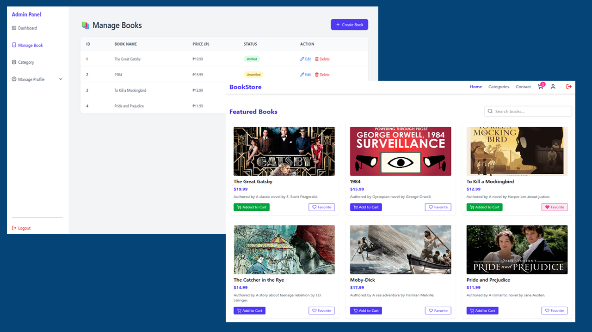

# 📚 Book Store Frontend

A fully functional frontend book store web application built with React. This project demonstrates user authentication using `localStorage`, interactive cart functionality, favorites management, and a simple admin panel for managing books and categories.

---

## 📑 Table of Contents

- [Overview](#overview)
  - [Screenshot](#screenshot)
  - [Links](#links)
- [Login Credentials](#login-credentials)
- [My Process](#my-process)
  - [Built With](#built-with)
  - [What I Learned](#what-i-learned)

---

## 📖 Overview

This book store web app allows users to browse books, mark favorites, and add items to a cart — but only if they are logged in. Admins have access to a dashboard with data on users, books, and categories, and can manage (edit/delete) books and categories.

### 🖼️ Screenshot

### 🔗 Links

- Live Site: [View Project](https://your-live-site-link.com)
- Repository: [GitHub Repo](https://github.com/Ramelzkie96/bookstore)

---

## 🔐 Login Credentials

To log in and access user functionality like adding to cart and favorites, use the following hardcoded credentials:

- **Email:** `ramel@gmail.com`  
- **Password:** `Ramel12345`

> ⚠️ These credentials are for demo purposes only and stored using `localStorage`.

---

## 🔧 My Process

### 🛠️ Built With

- React
- Tailwind CSS
- React Router DOM
- Lucide React Icons
- LocalStorage (for authentication and state)

### 🚀 Features

- User login system using `localStorage`
- Conditional UI: users must log in to add to cart or mark favorites
- Dynamic cart with item quantity, per-item price, and total payment calculation
- Checkout form including user details and credit card fields
- Favorite books functionality (only available after login)
- Admin dashboard with total counts (users, books, categories)
- Book management (edit/delete)
- Category management (create/edit/delete)

### 🤓 What I Learned

- How to use `localStorage` for authentication and session management
- Conditional rendering based on user state
- State lifting for shared UI elements (e.g., cart count in header)
- React routing with protected pages and nested layouts
- Building a basic admin interface in the same frontend app
- Managing state for dynamic pricing in the cart with quantity updates

---

💡 Feel free to contribute or fork the project to enhance it with a backend or more features!
